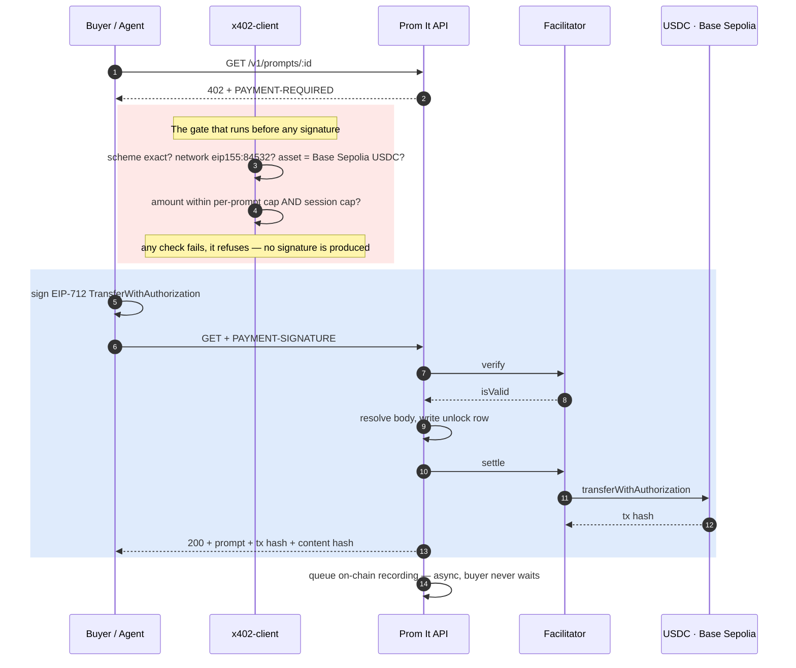

<div align="center">


# Prom It

### Buy one prompt for cents. Not a $300 lifetime bundle you'll use once.

**A pay-per-prompt marketplace on [Base Sepolia](https://sepolia.basescan.org), settled over [x402](https://x402.org).**
A buyer signs a message and pays USDC — no account, no card, no API key.
So does an autonomous agent, from a CLI, an MCP server, or a Claude Code skill.

<br/>

[](https://sepolia.basescan.org)
[](https://sepolia.basescan.org/address/0x30c92fFadAd24Ca079227A92A33b78683D36Fde6)
[](#the-gates)
[](https://x402.org)
[](https://promit-two.vercel.app)

**[Live app](https://promit-two.vercel.app)** ·
**[API](https://promitbackend-production.up.railway.app/v1/catalog)** ·
**[Settled transaction](https://sepolia.basescan.org/tx/0x7b62a3ae1bd835907f3f4b9541cf9b4b082c687c5267795178ad2e2c5aad6a85)** ·
**[PromitRegistry](https://sepolia.basescan.org/address/0x30c92fFadAd24Ca079227A92A33b78683D36Fde6)** ·
**[Architecture](docs/ARCHITECTURE.md)**

</div>

---

## The problem

Prompt libraries sell lifetime access. MotionSites charges $300+ for its catalog; a buyer who needs
one prompt still pays $300.

That is not greed — it is arithmetic. Stripe takes roughly **$0.30 plus 2.9%** per transaction, so
processing a five-cent sale costs six times the price of the good. Bundling is the only shape that
clears the fee.

**Micropayments for digital goods died for cost reasons, not demand reasons.**

---

## The claim, and the receipt

x402 removes the floor: a USDC transfer on Base under a tenth of a cent of gas, final in seconds.
Easy to assert. Here it is settled on-chain:

| | |
|---|---|
| Transaction | [`0x7b62a3ae…6a85`](https://sepolia.basescan.org/tx/0x7b62a3ae1bd835907f3f4b9541cf9b4b082c687c5267795178ad2e2c5aad6a85) |
| Status | success · block 45141360 · settled in **533 ms** |
| Signer (payer) | [`0xadE939F2…644c`](https://sepolia.basescan.org/address/0xadE939F26516c657fc01f2eD1B069562b672644c) — holds **0 wei ETH** |
| `tx.from` (gas payer) | `0xd407e409…f1bf` — the facilitator's own signer |

Read the last two rows together. **The buyer held no ETH and still paid USDC on-chain**, because they
signed an EIP-3009 authorization rather than sending a transaction, and the facilitator broadcast it.

That is the whole thesis — and it is why agents are the interesting buyer. An agent wallet needs only
stablecoin. There is no account to create, no key to provision, and no one to ask.

---

## 🟢 Live on Base Sepolia — verify it yourself

### Contracts (UUPS · AccessControl · source-verified)

| Contract | Address |
|---|---|
| **PromitRegistry** — proxy | [`0x30c92fFa…36Fde6`](https://sepolia.basescan.org/address/0x30c92fFadAd24Ca079227A92A33b78683D36Fde6) |
| **PromitRegistry** — implementation | [`0xfdB08337…B431776`](https://sepolia.basescan.org/address/0xfdB083371f44cF53181350389d3217E51B431776) |
| USDC (Circle, Base Sepolia) | [`0x036CbD53…8f3dCF7e`](https://sepolia.basescan.org/address/0x036CbD53842c5426634e7929541eC2318f3dCF7e) |

### Role separation is on-chain, not aspirational

The deployer holds **neither** role. Don't take our word for it — read it off the chain:

```bash
P=0x30c92fFadAd24Ca079227A92A33b78683D36Fde6
R=https://sepolia.base.org
cast call $P "hasRole(bytes32,address)(bool)" \
  $(cast call $P "SETTLER_ROLE()(bytes32)" --rpc-url $R) \
  0x56A2950ddE6B1040d1DCC4b4C4Fc314Bd56eFB0E --rpc-url $R    # deployer -> false
```

| Role | Holder | Can |
|---|---|---|
| `SETTLER_ROLE` | `0xdf280D50…6b91345` | record unlocks — **cannot upgrade** |
| `UPGRADER_ROLE` | `0xC0586732…E02491` | upgrade the implementation |
| deployer | `0x56A2950d…6eFB0E` | neither |

A compromised backend can write false unlock records. It **cannot** rewrite the contract.

### Receipts, not screenshots

| Claim | Proof |
|---|---|
| 💸 **Settlement works, gasless for the payer** | [tx `0x7b62a3ae…`](https://sepolia.basescan.org/tx/0x7b62a3ae1bd835907f3f4b9541cf9b4b082c687c5267795178ad2e2c5aad6a85) — payer holds 0 wei; `tx.from` is the facilitator |
| 📜 **Contracts are verified** | [proxy](https://sepolia.basescan.org/address/0x30c92fFadAd24Ca079227A92A33b78683D36Fde6) + [implementation](https://sepolia.basescan.org/address/0xfdB083371f44cF53181350389d3217E51B431776), both source-verified |
| 🔐 **Roles are separated** | `hasRole` on the proxy — deployer returns `false` for both |
| 🧪 **The code passes** | **339** tests across 7 packages — [see the gates](#the-gates) |
| 📦 **What was deployed** | [`smartcontract/broadcast/`](smartcontract/broadcast) — the real transaction record, in the repo |

---

## How a purchase works

The payer signs a message. They never send a transaction, and they never need ETH.



**Ordering is the money-path invariant.** The body is resolved and the unlock row written *before*
settlement is invoked. If the body still cannot be delivered afterwards, the row is marked
`settled_but_undelivered` — so a buyer can never be charged with no trace and no refund path.

---

## 🤖 Why an agent buys instead of writing its own

> A paid listing carries a preview **generated by running that exact prompt**. You are paying for
> verified output, not for text a model could improvise in a second. That is the criterion the
> Claude Code skill reasons from — without it the agent has no basis to decide, and the demo has no
> answer to the first question a judge asks.

Four surfaces, **one payment client**, so the safety limits cannot drift apart:

| Surface | How you use it |
|---|---|
| **Browser** | Connect via Reown AppKit, unlock a prompt |
| **CLI** | `promit search` · `preview` · `buy` · `verify` · `wallet` |
| **MCP server** | `promit_search` · `promit_preview` · `promit_buy` |
| **Claude Code plugin** | Skill + MCP server in one install |

### Three properties that make unattended buying safe

**The cap pins denomination before amount.** An amount-only cap is defeated by an 18-decimal token
whose `amount` looks small against a 6-decimal USDC threshold. The filter rejects any scheme,
network, or asset that is not the pinned one — *then* compares the number.

**A per-prompt cap alone is not a budget.** Two hundred purchases at $0.099 drain a wallet while every
single one passes. A cumulative session cap persists to disk, so a restarted agent cannot reset its
own budget.

**Purchased text is untrusted data.** Anyone can list a prompt, an agent buys it unattended, and the
text lands in a tool-enabled session holding a private key. The buy tool returns bodies inside a
nonce-delimited block — the nonce is generated *after* the seller's body exists, so a seller cannot
close the block from inside.

---

## 🔒 The paywall, and why the competitor's leaks

MotionSites ships its **entire prompt library inside the client bundle** and enforces the paywall in
the UI. Clicking "copy prompt" fires no network request at all — the text was already on your machine.

Prom It's catalog splits a public face from a private body as **separate types**, and a paid body in
the git-tracked catalog is a **schema load error**, not a leak waiting to be found:

```ts
.refine((entry) => entry.tier === "free" || entry.body === undefined)
```

Prompt text travels through exactly one route — the x402-gated one. Free-tier entries return text
without payment by design, and that carve-out is written into the requirement rather than discovered
later.

### Buyers who come back are not charged twice

Ownership is **proved, not claimed**. The client signs
`promit.entitlement.v1|<promptId>|<nonce>|<issuedAt>`; the server recovers the address itself. The
`promptId` comes from the request path, so a signature cannot be moved between prompts. A malformed,
expired, or wrong-signer proof returns a hard `401` — it **never silently falls through to charging**.

Unlocks are also recorded on-chain, which means the database can be lost and the proof cannot.

---

## <a id="the-gates"></a>🧪 The gates

Run them yourself. Frontend uses vitest, everything else uses `bun test` — a root `bun test` reports
false failures because it tries to run vitest files with bun's runner.

| Package | Command | Tests |
|---|---|---|
| `smartcontract` | `forge clean && forge test` | **22** |
| `backend` | `bun test` | **126** |
| `packages/x402-client` | `bun test` | **43** |
| `cli` | `bun test` | **43** |
| `mcp` | `bun test` | **26** |
| `plugin` | `bun test` | **15** |
| `frontend` | `bun run test` | **64** |

The contract suite includes a test that deliberately reorders storage and asserts the OpenZeppelin
upgrade validator **rejects** it — asserting the reason string, so a broken `ffi` environment fails
loudly instead of faking a pass.

---

## Deployments

| Surface | Where | Verify |
|---|---|---|
| App | [promit-two.vercel.app](https://promit-two.vercel.app) | landing, gallery, creator listing |
| API | [promitbackend-production.up.railway.app](https://promitbackend-production.up.railway.app/health) | `/health` returns `{"ok":true}` |
| Catalog | [`/v1/catalog`](https://promitbackend-production.up.railway.app/v1/catalog) | 23 entries, no prompt bodies |
| Contract | [Basescan](https://sepolia.basescan.org/address/0x30c92fFadAd24Ca079227A92A33b78683D36Fde6) | proxy + implementation verified |

The CLI talks to the deployed API out of the box:

```bash
bun cli/src/cli.ts search hero
```

---

## Repository

```
frontend/              Next 16 — landing, gallery, unlock, creator listing
backend/               Hono on bun — catalog, x402 unlock, entitlement, settler
packages/x402-client/  Shared payment client: caps, policy filter, hash check
smartcontract/         Foundry — PromitRegistry (UUPS), deploy + upgrade scripts
cli/                   citty CLI, bundles to zero runtime dependencies
mcp/                   MCP server (@modelcontextprotocol/server v2)
plugin/                Claude Code plugin: skill + MCP wiring
scripts/               Facilitator settlement spike
docs/                  Architecture, content-hash rule, implementation plan
```

---

## Getting started

Requires [bun](https://bun.sh) 1.3+, [Foundry](https://getfoundry.sh), Node 20+.

```bash
bun install
cp .env.example .env        # PAY_TO_ADDRESS must be an EOA — see limitations

cd backend  && bun run src/index.ts     # :3001
cd frontend && bun run dev              # :3000, talks to the deployed API by default
```

To reproduce the settlement proof, fund a wallet with Base Sepolia USDC at
[faucet.circle.com](https://faucet.circle.com) — **no ETH needed** — then:

```bash
bun run scripts/spike-facilitator.ts
```

---

## ⚠️ Notes on the ecosystem

Three things will cost you hours if you follow current tutorials. All were found by running code, not
by reading docs.

- **x402 is on v2.** The unscoped `x402-*` packages are deprecated. Headers, network strings, and the
  amount field all changed, and only v2 supports the per-resource dynamic pricing this needs.
- **The facilitator URL in the official v2 READMEs is NXDOMAIN.** `facilitator.x402.org` does not
  resolve. Use `https://x402.org/facilitator`.
- **The MCP TypeScript SDK was replaced on 2026-07-27** by a nine-package split at v2. Every MCP
  tutorial predating August 2026 targets v1, whose API is gone.

The facilitator also has three behaviours worth knowing before you debug the wrong thing: an unknown
scheme returns **HTTP 500** rather than a clean 4xx, a **corrupted signature is mislabelled**
`insufficient_balance`, and `payer` on a failure response merely echoes the unverified claim. All
three are documented in [`docs/ARCHITECTURE.md`](docs/ARCHITECTURE.md).

---

## 🔒 Security & limitations

We would rather you read this than discover it.

- **Testnet only.** Base Sepolia, faucet USDC. No real-money path exists in this build.
- **`PAY_TO_ADDRESS` must be an EOA.** The registry has no withdrawal path by design — USDC sent
  there is unrecoverable without an upgrade.
- **The upgrade authority is the residual trust root.** Whoever holds it can rewrite stored content
  hashes, so "verify without trusting Prom It" reduces to trusting that one key. It is held outside the
  backend and deploy environments; a multisig is the stronger posture.
- **The facilitator is a third-party dependency** on the critical path of every purchase. It is
  unversioned and publishes no uptime guarantee. `FACILITATOR_URL` makes it swappable.
- **No accounts means no identity-based rate limiting.** On mainnet the per-prompt price is itself the
  limiter — attacking an endpoint costs real money.

---

## Attribution

Seed catalog entries are **free-tier** prompts from [motionsites.ai](https://motionsites.ai), labelled
free and attributed per entry. MotionSites co-hosts ChainHack 2026, whose main track asks how builders
can resell prompts using x402 — Prom It answers that as the resale layer, not a competing storefront.
Paid listings are original work.

---

<div align="center">
<br/>

**Built for ChainHack 2026 / NeuralLedger 5.0** · AI × Web3

[Settled transaction](https://sepolia.basescan.org/tx/0x7b62a3ae1bd835907f3f4b9541cf9b4b082c687c5267795178ad2e2c5aad6a85) ·
[PromitRegistry](https://sepolia.basescan.org/address/0x30c92fFadAd24Ca079227A92A33b78683D36Fde6) ·
[Architecture](docs/ARCHITECTURE.md)

<sub>Base Sepolia (84532) · USDC via EIP-3009 · x402 v2</sub>

</div>
