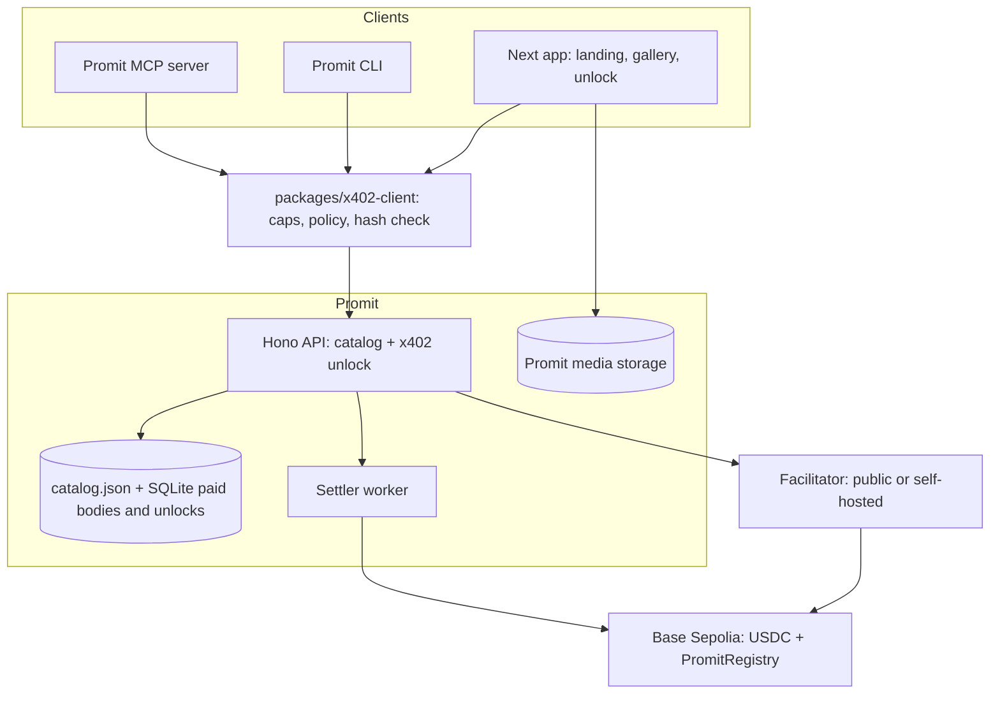
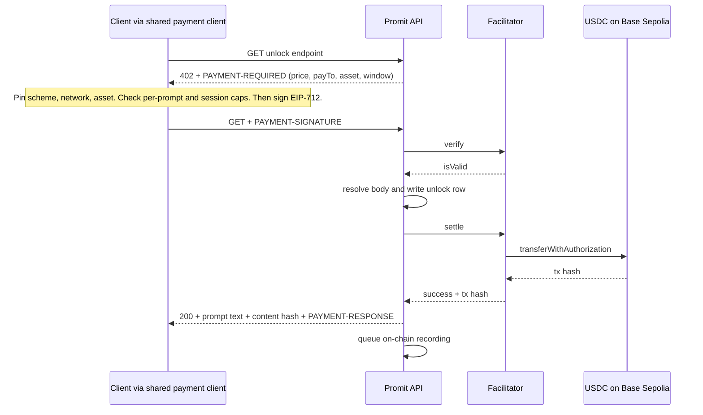
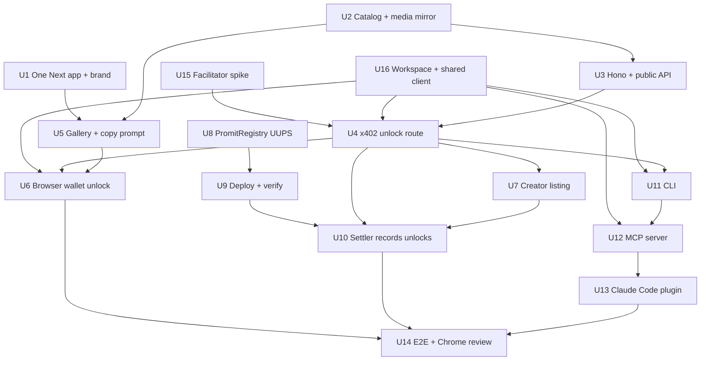

# Promit Pay-Per-Prompt Marketplace - Plan

## Goal Capsule

- **Objective:** ship Promit end-to-end on Base Sepolia — a prompt catalog where one prompt unlocks for cents of USDC through x402, usable by a human in a browser and by an autonomous agent through a CLI, an MCP server, and a Claude Code skill, backed by a source-verified UUPS registry.
- **Authority hierarchy:** direct user instruction > this plan > `docs/ARCHITECTURE.md` > existing repo conventions.
- **Execution profile:** autonomous through the unit sequence; stop at the listed stop conditions rather than guessing.
- **Demo spine vs cut tier:** U15, U16, U1–U6 and U11–U14 are the spine — they carry the pay-per-prompt claim and the agent-buys-autonomously claim. U7 and U8–U10 are the cut tier: KTD3 already keeps the registry off the payment path, so dropping them degrades the pitch without breaking any purchase flow. Cut from the tier before cutting from the spine.
- **Stop conditions:** any step requiring mainnet funds or a mainnet key; a change that contradicts a locked decision in Key Technical Decisions; the public facilitator being unreachable after the fallback in KTD21 is also tried; publishing any package to a public registry.
- **Tail ownership:** commit per unit on the current branch. Do not open a PR or push unless asked.

---

## Product Contract

### Summary

Promit turns any prompt into an x402-payable resource on Base Sepolia. Creators list and price a prompt, buyers unlock it for cents of USDC, and autonomous agents do the same with no human present. This plan builds the catalog interface, the payment-gated content API, three agent surfaces, and an upgradeable verified registry.

### Problem Frame

Prompt libraries sell lifetime access because no payment rail makes a five-cent sale viable. MotionSites charges $300+ for its catalog; a buyer who needs one prompt still pays $300. Stripe takes roughly $0.30 plus 2.9% per transaction, so the processing cost is six times the price of the good.

There is a competing explanation worth stating, because a judge will raise it: zero-marginal-cost goods get bundled because bundling maximizes revenue, not because the rail is expensive. If that holds, cheap settlement changes nothing about how prompts are priced. The evidence that distinguishes the two is a single observed per-item purchase by someone who would not have bought the bundle — which is exactly what the demo produces, and why U14 requires a *paid* purchase rather than any purchase.

x402 removes the cost floor regardless. Settlement is a USDC transfer on Base under a tenth of a cent of gas, final in seconds, and the payer signs an EIP-712 message rather than sending a transaction, so a buyer needs no ETH at all.

The second-order effect matters more than the price. Once a prompt is purchasable over plain HTTP with no account and no API key, an agent can buy one on its own initiative. No existing prompt library serves that buyer.

MotionSites is a co-host of ChainHack 2026 and its main track asks how builders can resell prompts using x402. Promit answers that as the resale layer rather than as a competing storefront.

### Actors

- A1. Buyer — a human who browses the gallery, connects a wallet, and unlocks a prompt.
- A2. Agent — an autonomous MCP or CLI client with a funded wallet that buys without human input.
- A3. Creator — lists a prompt, sets its price, and receives attribution.
- A4. Settler — the Promit backend service that confirms settlement and records unlocks on-chain.

### Requirements

**Catalog and discovery**

- R1. The catalog serves prompt metadata — title, category, preview media, teaser — without payment.
- R2. A paid prompt's full text never reaches a client before settlement is confirmed. Free-tier prompts under R3 return full text with no payment, which is a deliberate carve-out, not a violation.
- R3. Seed prompts sourced from the MotionSites free tier are labelled free and carry source attribution.
- R4. The gallery filters by category and plays preview video inline.
- R5. Preview media is served from Promit-owned storage rather than a third-party bucket.
- R24. Every paid listing carries a preview generated by running that exact prompt, and the catalog states that the preview is the prompt's own output.

**Payment and unlock**

- R6. An unpaid request for a paid prompt returns HTTP 402 carrying x402 v2 payment requirements.
- R7. Settlement uses the `exact` scheme with USDC on Base Sepolia through a facilitator selected at runtime.
- R8. Price resolves per prompt at request time rather than being fixed per route.
- R9. A successful unlock response carries the settlement transaction hash and the prompt's content hash.
- R10. A payment that verifies but fails to settle does not unlock the prompt, and a settled payment whose content cannot be delivered is recorded rather than lost.

**Creator listing**

- R11. A creator submits a prompt with title, category, preview media, and price, within published price bounds.
- R12. Each listing stores a content hash computed by a published, byte-exact normalization rule, so a buyer can independently recompute it.
- R26. A listing is accepted only when a wallet signature over the listing payload recovers to the claimed creator address.

**Agent surfaces**

- R13. The CLI searches, previews, buys, and verifies a prompt, and prints an ASCII-art banner.
- R14. The MCP server exposes search, preview, and buy as tools.
- R15. A Claude Code skill lets an agent discover and use Promit without being told the API shape.
- R16. Every agent surface enforces a per-prompt cap and a cumulative session cap, and refuses to sign above either.
- R17. An agent wallet needs only USDC, never ETH. This covers buyer wallets only — Promit's own deployer and settler keys send transactions and need gas.
- R25. Purchased prompt text reaches an agent as delimited untrusted data, never as instructions to follow.

**On-chain registry**

- R18. PromitRegistry is UUPS-upgradeable and source-verified on Base Sepolia.
- R19. The registry records each unlock idempotently, keyed on the payer and the payment nonce together.
- R20. An upgrade preserves prior listings and unlock records.

**Brand and interface**

- R21. The landing page carries Promit branding rather than the Stellar.ai placeholder.
- R22. One Next application serves landing, gallery, and unlock.
- R23. The frontend is reviewed in a real browser through Claude Chrome before it counts as done.
- R27. Every interactive surface names its pending, empty, and error states rather than leaving them to the implementer.

### Key Flows

- F1. Human unlock
  - **Trigger:** A1 opens a paid prompt's detail page and clicks unlock.
  - **Actors:** A1, A4
  - **Steps:** Browser requests the unlock endpoint; server answers 402 with requirements; interface states that this is a signature and costs no gas; wallet signs an EIP-712 authorization; browser retries with the signature; server verifies and settles; server returns prompt text, content hash, and transaction hash.
  - **Outcome:** Prompt text is on screen with a Basescan link and a hash-match indicator.
  - **Covered by:** R2, R6, R7, R9, R10, R27

- F2. Agent unlock
  - **Trigger:** A2 is asked to build something and needs a matching prompt.
  - **Actors:** A2, A4
  - **Steps:** Agent searches the catalog; reads teaser, price, and the preview-is-this-prompt's-output claim; checks price against both caps; buys a paid prompt; receives text wrapped as untrusted data plus a transaction hash.
  - **Outcome:** Agent holds the prompt with no human in the loop and a settlement exists on chain.
  - **Covered by:** R13, R14, R15, R16, R17, R24, R25

- F3. Creator listing
  - **Trigger:** A3 wants to sell a prompt they wrote.
  - **Actors:** A3, A4
  - **Steps:** Creator signs and submits prompt, metadata, preview, and price; server verifies the signature, computes the content hash, mirrors the media; registry records the listing; the prompt appears as paid.
  - **Outcome:** A new paid prompt is purchasable by A1 and A2.
  - **Covered by:** R11, R12, R18, R24, R26

### Acceptance Examples

- AE1. **Given** a paid prompt, **when** a client calls the unlock endpoint with no payment header, **then** the response status is 402 and the body contains no prompt text.
- AE2. **Given** a wallet funded with test USDC, **when** the CLI buys a paid prompt, **then** the prompt text prints and a Base Sepolia transaction hash is shown.
- AE3. **Given** a seed prompt marked free, **when** any client requests it, **then** full text returns with no payment required and source attribution is present.
- AE4. **Given** an agent with a per-prompt cap of $0.10, **when** an endpoint demands $5.00, **then** the agent refuses and produces no signature.
- AE5. **Given** a settled unlock, **when** the settler records it twice with the same payer and nonce, **then** the registry holds exactly one record and the retry sends no transaction.
- AE6. **Given** an upgraded registry implementation, **when** a previously recorded unlock is read, **then** its contents are unchanged.
- AE7. **Given** a delivered prompt, **when** `promit verify` recomputes its hash under the published normalization rule and compares it to the registry, **then** a mismatch is reported without trusting Promit's own answer.
- AE8. **Given** a session cap of $0.50 and five completed $0.10 purchases, **when** a sixth $0.10 purchase is attempted, **then** it is refused and the refusal names the running total and the cap.
- AE9. **Given** a listing whose body contains imperative directives, **when** an agent buys it, **then** the text is returned inside a delimited untrusted-data block and no directive is executed.
- AE10. **Given** a listing payload whose signature does not recover to the claimed creator address, **when** it is submitted, **then** it is rejected.
- AE11. **Given** a 402 naming an asset other than Base Sepolia USDC, **when** the amount is below the configured cap, **then** the agent still refuses before producing a signature.

### Scope Boundaries

**In scope:** everything the Requirements above describe, on Base Sepolia testnet only.

**Deferred for later**

- Base mainnet, the CDP facilitator, and any real-money settlement.
- On-chain creator payouts and revenue splitting — the registry records unlocks but does not custody funds.
- ERC-1155 access passes and resale of unlock receipts.
- Semantic or embedding-based catalog search.
- Publishing the CLI, MCP server, or plugin to any public registry.

**Outside this product's identity**

- User accounts, passwords, and session auth. Payment identity is the wallet; that is the point.
- Fiat payment paths.
- Hosting or deploying the sites that generated prompts produce.

---

## Planning Contract

### Key Technical Decisions

- KTD1. **x402 protocol v2, not v1.** The unscoped `x402-*` packages are frozen at 1.2.0 and deprecated; the `@x402/*` line is at 2.21.0. Only v2 supports function-valued per-resource pricing, which R8 requires. v2 also changes the headers to `PAYMENT-REQUIRED` / `PAYMENT-SIGNATURE` / `PAYMENT-RESPONSE` and the network identifier to the CAIP-2 form `eip155:84532`. Mixing v1 network strings into v2 packages fails with `invalid_network`.

- KTD2. **Default facilitator is `https://x402.org/facilitator`.** The v2 package READMEs print `https://facilitator.x402.org`, which does not resolve in DNS. The correct host was confirmed live and advertises `exact`, `upto`, and `batch-settlement` on `eip155:84532` with no API key. It is testnet-only by design.

- KTD3. **Payment lands in a plain wallet; the registry records but never custodies.** Keeping the contract off the payment path means a contract bug cannot take the payment demo down. The registry has no withdrawal path, so `PAY_TO_ADDRESS` must never be set to the proxy address. R18's upgradeability is a user-stated requirement for this project, not a consequence of a revenue-split roadmap that this plan defers; it is therefore not negotiable on cost grounds.

- KTD4. **One Next application.** `landingpage/` and `frontend/` are duplicate boilerplate and the gallery is the product. Consolidating into `frontend/` removes a second copy of the config, wallet provider, and design system.

- KTD5. **Backend is Hono on bun, separate from Next.** The paid API is itself a product surface that agents call directly; binding it to the Next deployment lifecycle would couple it to the UI. `@x402/hono` exists at 2.21.0.

- KTD6. **Prompt text is server-only, and the API is two-tiered.** The MotionSites teardown showed their entire library ships inside the client bundle with the paywall enforced only in the UI. Promit's public endpoints return metadata and teaser; paid text exists only behind the x402 route. This is what R2 protects, and U14 greps the built bundle to prove it.

- KTD7. **MCP server uses `@modelcontextprotocol/server@2.0.0`, pinned exactly.** The TypeScript SDK was replaced on 2026-07-27 by a nine-package split at v2, and the v1 line is now legacy. Honest accounting: this plan consumes no v2-only capability — it runs in legacy protocol mode per KTD9 — so the choice is forward-compatibility and avoiding a deprecated dependency, not necessity. Because the package is days old, pin the exact version so it cannot shift underneath U12 mid-build.

- KTD8. **Skip `@x402/mcp`.** It depends on `@modelcontextprotocol/sdk ^1.12.1` and `zod ^3.24.2`, which would pin the whole MCP surface to v1 and Zod 3. Tool handlers instead pay through the shared client from KTD19, which is the same code path the CLI and browser use — so spend-cap enforcement has one implementation rather than three.

- KTD9. **Leave MCP legacy compatibility on.** Claude Code negotiates protocol `2025-11-25`, so `serveStdio`'s default `legacy: 'serve'` is required; `legacy: 'reject'` would refuse the only client that matters. Because the inspector negotiates the current protocol and never traverses the legacy path, U12 must also connect a real Claude Code session.

- KTD10. **CLI framework is `citty@0.2.2`.** Zero dependencies, 34.5 KB unpacked, lazy subcommands, and option types that flow into the handler. `commander@15` declares `engines.node >= 22.12.0`, which would reject a judge or teammate running the CLI under Node 20 after cloning the repo — that clone-and-run path, not `npx`, is the distribution this plan actually reaches.

- KTD11. **The CLI bundles to zero runtime dependencies and is not published.** `citty`, `figlet`, `gradient-string`, `picocolors`, `@clack/prompts`, and `console-table-printer` are devDependencies bundled by `bun build --target node --format esm --minify`. The shebang is `#!/usr/bin/env node`, never `bun`. npm publication is out of scope, so no time goes into registry-readiness work; `bun build --compile` is also excluded, at 58 MB per platform binary.

- KTD12. **Load figlet fonts as modules.** `figlet.textSync(text, { font })` reads `.flf` files from disk at runtime and throws ENOENT once bundled. Importing `figlet/fonts/<Name>` — with no `.js` suffix, which breaks typechecking — and calling `parseFont` produces a self-contained bundle. Do not install `@types/figlet`; it is stale and exports a different type name than figlet 1.11.4's bundled declarations.

- KTD13. **Colour through `picocolors`, not `node:util.styleText`.** Bun's `styleText` ignores both `NO_COLOR` and TTY detection, so piping CLI output to a file embeds escape codes. Hex colours throw on both runtimes.

- KTD14. **Spend caps pin the denomination before they check the amount.** The policy filter rejects any payment requirement whose scheme is not `exact`, whose network is not `eip155:84532`, or whose asset is not `0x036CbD53842c5426634e7929541eC2318f3dCF7e`, and only then compares the atomic amount against the per-prompt cap and the cumulative session cap. Amount-only filtering is defeated by denomination: an 18-decimal token with a small `amount` signs away orders of magnitude more value than a 6-decimal USDC threshold implies. A per-prompt cap alone is defeated by repetition — two hundred purchases at $0.099 drain a wallet while every one passes. Both caps live in the shared client from KTD19, never in skill prose.

- KTD15. **Key access differs by surface because the MCP server cannot prompt.** The CLI defaults to an encrypted keystore under `~/.config/promit/keystores/` with `PROMIT_PRIVATE_KEY` as the automation override. The MCP server reads `PROMIT_PRIVATE_KEY` only and exits with a named error when it is absent — stdin is the JSON-RPC channel, so a password prompt is impossible, and the alternative an implementer would otherwise reach for is a literal key inside a committed `.mcp.json`. viem has no keystore encrypt or decrypt, so `ethers@6` supplies those two calls only.

- KTD16. **Ship the skill and MCP server together as a Claude Code plugin.** A `.claude-plugin/plugin.json` alongside `skills/promit/SKILL.md` and `.mcp.json` means one install delivers both. The skill's slash command name comes from its directory name, not the `name:` field, and `version:` is not a real frontmatter field.

- KTD17. **Public metadata and free bodies in git; paid bodies in `bun:sqlite`.** `backend/data/catalog.json` holds public entries plus free-tier text, which keeps the seed reviewable in a diff. Every paid body — seed-derived or creator-submitted — is written to the gitignored SQLite store alongside unlock records. Committing paid text would make it readable to anyone who clones the repo, and it would survive in git history after deletion; runtime listing writes also cannot land in a file that U2's normalizer regenerates.

- KTD18. **Never hardcode the EIP-712 domain.** Base Sepolia USDC reports `name` as `USDC` while mainnet USDC reports `USD Coin`. Read the domain from `accepts[].extra` — and note this is precisely why KTD14 pins the asset separately, since a server-supplied domain means the counterparty controls the fields that define what is being signed.

- KTD19. **One shared payment client in a workspace package.** A root `package.json` declares a bun workspace over `frontend`, `backend`, `cli`, `mcp`, and `packages/x402-client`. The package holds the policy filter, the cap configuration and persistence, the `onBeforePaymentCreation` hook, and the post-unlock hash check. Without it there is nowhere for `mcp/` to import the CLI's client from, and the safety-critical cap logic gets three hand-written copies that drift.

- KTD20. **Purchased prompt text is untrusted content.** Anyone can list a prompt, an agent buys unattended, and the text lands in a tool-enabled session holding a private key. The buy tool wraps the body in a delimited untrusted-data block, and both the tool description and the skill state that purchased text is material to hand to the user, never instructions to follow.

- KTD21. **The facilitator is selected by `FACILITATOR_URL` with a self-hosted fallback.** A single unversioned third party sits on the critical path of every purchase, and "print a clearer error" is not a contingency. `@x402/core/facilitator` with `registerExactEvmScheme` runs locally against a funded key; U14 completes one unlock through it so the switch is proven before it is needed.

### High-Level Technical Design

Component topology — three clients, one shared payment client, one paid API, one chain:

Payment sequence — the payer signs a message and never sends a transaction:

Unit dependency order:

### Open Questions

None block implementation; each carries a default the implementer can take.

- **Where mirrored preview media lives.** Deferred. Default: `frontend/public/media/`, which adds roughly 45 MB (23 MB of catalog previews plus the 22 MB landing hero) and has no external dependency. The mirror script writes an absolute base URL from `NEXT_PUBLIC_MEDIA_BASE` into the catalog so CLI and MCP clients, which read the catalog from the Hono API rather than the Next app, resolve previews correctly.
- **Registry upgrade authority holder.** Deferred. Default: a dedicated EOA held outside the backend and deploy environments, recorded in the contract README. A Safe multisig is the stronger posture if one is available on Base Sepolia.
- **Where the demo runs.** Deferred. Default: local backend and frontend against live Base Sepolia, which satisfies every acceptance example.

### System-Wide Impact

**Agent and interface parity.** Search, preview, and purchase are reachable from the browser, the CLI, and the MCP server, and KTD19 makes that literal — all three import one payment client, so a cap change cannot land in two places and miss the third. Creator listing is web-only: an agent can buy but cannot sell. That asymmetry is deliberate for now and is the first gap to close if the resale-layer positioning is pushed further.

**Secret handling surface.** Four keys exist: the buyer's browser wallet, which Promit never sees; the agent key on a user's disk; the settler key holding an on-chain role; and the upgrade authority. The settler holds only the settler role, so a backend compromise cannot upgrade the registry — but the upgrade authority can rewrite any stored hash, which means AE7's guarantee reduces to trusting that one key. State that honestly rather than claiming trustlessness.

**Failure posture.** The facilitator is a third-party dependency on every purchase. KTD21 makes it swappable and U14 proves the swap, so the response to an outage is a configuration change rather than an explanation.

### Risks and Dependencies

- Verify and settle are two steps, and so are settle and deliver. A payload that passes verification can fail settlement; a settled payment can still fail to produce a body. R10 covers both directions and U4 tests both.
- MCP protocol `2026-07-28` removed the initialize handshake and server-initiated requests and deprecated sampling, roots, and logging. Claude Code still speaks `2025-11-25`. Build against the SDK's legacy-serving default.
- **Gas funding is not optional for Promit's own keys.** R17's no-ETH promise covers buyers only. The deployer sends two contract deployments in U9 and the settler sends one transaction per unlock in U10; both need Base Sepolia ETH from `https://portal.cdp.coinbase.com/products/faucet`. Fund both before starting U9. U10's design keeps serving unlocks when the chain is unreachable, so an unfunded settler fails silently.
- Circle's faucet dispenses 20 test USDC per address every two hours. Fund the demo wallets before the demo, not during.
- Preview media totals roughly 45 MB including the landing hero. The storage target must exist before U2 finishes.
- Foundry 1.7.1 rejects `forge install <repo>@tag=<v>` even for tags that exist. Dependencies are already installed and pinned; re-running installs needs the manual checkout workaround.
- `smartcontract/.github/workflows/test.yml` sets up no Node runtime, which `openzeppelin-foundry-upgrades` needs for its `npx @openzeppelin/upgrades-core` shell-out. U8 is the first work that exercises it.
- wagmi and viem interoperating with Next 16.3.0, React 19.2.8, and `babel-plugin-react-compiler` has no prior art cited; U6 is the only place that integration is exercised.

### Sources and Research

- `docs/ARCHITECTURE.md` — verified protocol facts, the MotionSites teardown, and the operational notes that already bit during setup.
- `backend/data/motionsites-free.json` — 23 free-tier seed prompts, 8 with `.mp4` previews, captured 2026-08-07.
- USDC on Base Sepolia at `0x036CbD53842c5426634e7929541eC2318f3dCF7e`, read on-chain: `decimals` 6, `version` 2, EIP-3009 present.
- Facilitator capability list from `https://x402.org/facilitator/supported`.
- MCP TypeScript SDK v2 package split and the `2026-07-28` specification changelog.
- Claude Code skills and plugin references at `code.claude.com/docs/en`; the older `docs.claude.com` paths now redirect.

---

## Implementation Units

### Unit Index

Listed in execution order. U-IDs are stable labels, not sequence numbers.

| U-ID | Title | Key paths | Depends on |
|---|---|---|---|
| U15 | Facilitator settlement spike | `scripts/spike-facilitator.ts` | — |
| U16 | Workspace and shared payment client | `package.json`, `packages/x402-client/` | — |
| U1 | One Next app under Promit branding | `frontend/src/app/`, `frontend/public/` | — |
| U2 | Catalog schema, seed normalization, media mirror | `backend/src/catalog/`, `backend/data/` | — |
| U3 | Hono backend and public catalog API | `backend/src/index.ts`, `backend/src/routes/` | U2 |
| U4 | x402-gated unlock endpoint | `backend/src/routes/unlock.ts` | U3, U15, U16 |
| U5 | Gallery, prompt detail, copy prompt | `frontend/src/app/prompts/` | U1, U2 |
| U6 | Browser wallet and x402 unlock | `frontend/src/components/UnlockButton.tsx` | U4, U5, U16 |
| U7 | Creator listing flow | `frontend/src/app/list/`, `backend/src/routes/listings.ts` | U3, U4 |
| U8 | PromitRegistry UUPS contract and tests | `smartcontract/src/`, `smartcontract/test/` | — |
| U9 | Deploy and verify on Base Sepolia | `smartcontract/script/` | U8 |
| U10 | Settler records unlocks on-chain | `backend/src/settler/` | U4, U7, U9 |
| U11 | Promit CLI with ASCII-art banner | `cli/src/` | U4, U16 |
| U12 | Promit MCP server | `mcp/src/` | U11, U16 |
| U13 | Claude Code plugin: skill plus MCP wiring | `plugin/` | U12 |
| U14 | End-to-end verification and Chrome review | across surfaces | U6, U10, U13 |

### U15. Facilitator settlement spike

**Goal:** prove a real `exact`-scheme settlement completes on Base Sepolia before five units of work depend on it.

**Requirements:** R7

**Dependencies:** none

**Files:**
- `scripts/spike-facilitator.ts`
- `docs/ARCHITECTURE.md` — record the observed behaviour

**Approach:** a throwaway script that signs one EIP-712 `TransferWithAuthorization` from a faucet-funded key, calls the facilitator's verify and settle endpoints directly, and prints the resulting transaction hash. The plan's own research already found the official v2 READMEs advertising a facilitator hostname that does not resolve, which is direct evidence this ecosystem's documentation cannot be trusted ahead of a live run. Discovering a second such discrepancy after the API and frontend are built is expensive; discovering it here costs one script.

Record what the facilitator actually returns — field names, error shapes, timing — because U4 is written against that contract.

**Test scenarios:**
- The script settles one payment and prints a transaction hash that resolves on Basescan.
- The `/supported` response lists `exact` on `eip155:84532`.
- A deliberately expired authorization is rejected with a named error rather than settling.

**Verification:** a transaction hash from the spike resolves on `sepolia.basescan.org`; the observed request and response shapes are written into `docs/ARCHITECTURE.md`.

### U16. Workspace and shared payment client

**Goal:** create the one place the browser, CLI, and MCP server all import their payment logic from.

**Requirements:** R16, R25, R27

**Dependencies:** none

**Files:**
- `package.json` — root, declaring the bun workspace
- `packages/x402-client/package.json`, `packages/x402-client/tsconfig.json`
- `packages/x402-client/src/client.ts` — policy filter and payment wrapper
- `packages/x402-client/src/caps.ts` — per-prompt and cumulative cap state
- `packages/x402-client/src/verify.ts` — post-unlock content-hash check
- `packages/x402-client/test/`

**Approach:** a workspace package holding the payment client that every surface consumes. The policy filter pins scheme, network, and asset before it compares amounts, per KTD14. Cumulative spend persists under `~/.config/promit/` so a restarted agent cannot reset its own budget. The post-unlock check recomputes the delivered text's hash and compares it against the registry value the API returns.

This unit exists because the repo has no root package and no shared directory, so `mcp/` cannot import from `cli/` without a relative path that breaks the published bundle. Three copies of a safety-critical cap is the failure this prevents.

**Test scenarios:**
- Covers AE4. A requirement above the per-prompt cap is refused before any signature, and the refusal names both amounts.
- Covers AE8. A sequence of individually-under-cap purchases is refused once the cumulative cap is reached, and the refusal names the running total.
- Covers AE11. A requirement naming a different asset or a different network is refused even when its amount is below the cap.
- A requirement whose scheme is not `exact` is refused.
- Cumulative spend survives a process restart.
- A delivered body whose hash does not match the registry value is reported as a mismatch rather than returned silently.

**Verification:** `bun test` passes in `packages/x402-client/`; `frontend`, `cli`, and `mcp` all resolve the package through the workspace.

### U1. One Next app under Promit branding

**Goal:** collapse two duplicate Next apps into one, replace the Stellar.ai placeholder, and stop serving the hero from a third-party CDN.

**Requirements:** R21, R22

**Dependencies:** none

**Files:**
- `frontend/src/app/page.tsx` — receives the hero currently in `landingpage/src/app/page.tsx`, rebranded
- `frontend/src/app/layout.tsx`, `frontend/src/app/globals.css`
- `frontend/src/components/Nav.tsx`, `frontend/src/components/Footer.tsx`
- `frontend/public/media/hero.mp4` — mirrored hero asset
- `frontend/package.json` — add `lucide-react`, `vitest`, `@vitejs/plugin-react`, `@testing-library/react`, `jsdom`, and a `test` script
- delete `landingpage/`

**Approach:** port the existing hero, keeping its structure — full-viewport shell, background video with white gradient masks, staggered entrance delays, glass partner pill — and replace the copy with Promit's. The headline carries the pay-per-prompt thesis rather than generic SaaS language.

Mirror the hero video into `frontend/public/` and reference it locally. As written today it is a 22 MB hotlink to a CloudFront host nobody here controls, sitting on the first screen a judge sees — the exact failure mode the catalog mirroring exists to prevent. Transcode it down while mirroring; 22 MB before anything renders is a real LCP cost.

This unit also installs the frontend test runner, because U5, U6, and U7 declare roughly fifteen behavioural scenarios and `bun run build` cannot exercise one of them.

**Test scenarios:**
- The landing route renders the Promit wordmark and no occurrence of "Stellar.ai".
- The landing route loads no media from a host outside the app's own origin.
- With `prefers-reduced-motion: reduce`, every staggered element ends at full opacity.
- The mobile menu toggles open and closed.
- `landingpage/` no longer exists and no import references it.

**Verification:** `bun run build`, `bun run lint`, and `bun run test` pass in `frontend/`.

### U2. Catalog schema, seed normalization, and media mirroring

**Goal:** turn the raw capture into a typed catalog with Promit-hosted media, a public/private split, and a hash rule a buyer can reproduce.

**Requirements:** R1, R2, R3, R5, R12, R24

**Dependencies:** none

**Files:**
- `backend/package.json`, `backend/tsconfig.json` — establishes the bun package with `zod`
- `backend/src/catalog/schema.ts`, `backend/src/catalog/normalize.ts`, `backend/src/catalog/hash.ts`, `backend/src/catalog/index.ts`
- `backend/data/catalog.json` — public entries plus free-tier bodies
- `backend/scripts/mirror-media.ts`
- `docs/CONTENT-HASH.md` — the published normalization rule

**Approach:** split each entry into a public face and a private body as separate types, so a public route cannot serialize a body — that separation is the mechanical enforcement of R2. Public carries id, title, category, teaser, preview URL, price, tier, and attribution.

Normalize categories on ingest: the capture contains both `Landing page` and `Landing Page`, plus `Hero` and `Hero Section`. Derive teasers from the first sentence or two, never the whole body.

The content hash rule must be byte-exact and published, because AE7 promises a buyer can verify without trusting Promit — and a hash over "normalized text" whose normalization is secret still requires trusting Promit. Export it as a documented function and describe it in `docs/CONTENT-HASH.md`.

Paid bodies go to the SQLite store per KTD17, never into the versioned JSON. This unit also owns the package manifest, because its own verification gate runs `bun test` in a directory that would otherwise have no package until U3.

**Test scenarios:**
- Normalizing the seed file yields 23 entries, each with a non-empty teaser and a stable id.
- Category normalization collapses `Landing page` and `Landing Page` to one value.
- The public entry type does not carry the prompt body, and the serialized public payload contains no prompt text.
- Hashing is byte-stable across runs and changes when the prompt text changes by one character.
- An independent implementation following `docs/CONTENT-HASH.md` produces the same hash for a fixture prompt.
- Every seed entry is tier `free` and carries source attribution.
- No paid body appears in `backend/data/catalog.json`.
- An entry whose media failed to mirror is flagged rather than pointing at the third-party bucket.

**Verification:** `bun test` passes in `backend/`; `backend/data/catalog.json` exists with 23 entries and no media URL pointing at a third-party host. **Exit criterion for U14:** the catalog holds at least three paid entries, each with a preview generated by running that exact prompt.

### U3. Hono backend and public catalog API

**Goal:** stand up the API that serves catalog metadata to every client.

**Requirements:** R1, R2, R4

**Dependencies:** U2

**Files:**
- `backend/src/index.ts`, `backend/src/routes/catalog.ts`, `backend/src/middleware/cors.ts`
- `backend/src/db.ts` — `bun:sqlite` for unlock records, paid bodies, and listings

**Approach:** a Hono app on bun exposing catalog list with category and tier filters, catalog detail returning the public entry, and health. CORS must expose `PAYMENT-REQUIRED` and `PAYMENT-RESPONSE` and allow `PAYMENT-SIGNATURE`; without the expose header the browser cannot read payment requirements or the transaction hash, and the failure is confusing because the request looks successful.

The SQLite schema covers all three runtime stores now, so U4, U7, and U10 have somewhere to write and the catalog id resolves against the union of seed entries and listings.

**Test scenarios:**
- Catalog list returns all entries and no paid bodies.
- Filtering by category returns only that category; an unknown category returns an empty list rather than an error.
- Catalog detail for a known id returns the public entry; an unknown id returns 404.
- An id that exists only as a creator listing resolves through the same detail route.
- A cross-origin preflight allows `PAYMENT-SIGNATURE` and exposes `PAYMENT-REQUIRED` and `PAYMENT-RESPONSE`.
- Health returns 200.

**Verification:** `bun test` passes in `backend/`; the server serves catalog list locally.

### U4. x402-gated unlock endpoint

**Goal:** deliver the paid content path — 402 when unpaid, prompt text plus both hashes when settled, and no silent loss when delivery fails.

**Requirements:** R2, R6, R7, R8, R9, R10

**Dependencies:** U3, U15, U16

**Files:**
- `backend/src/x402/server.ts`, `backend/src/x402/pricing.ts`
- `backend/src/routes/unlock.ts`, `backend/src/routes/unlock.test.ts`

**Approach:** register the exact-EVM scheme for `eip155:84532` against the facilitator named by `FACILITATOR_URL`, and gate the route with a function-valued price reading the prompt's price from the catalog union. Free-tier entries bypass payment and return their text directly, which is what keeps the seed catalog honest.

Settlement ordering is the money-path hazard and needs a concrete rule, not a caution. The Hono middleware settles even when the handler fails, so **resolve the body and write the unlock row before settlement is invoked**, and register an `onAfterSettle` hook that emits a `settled_but_undelivered` record — payment nonce, payer, amount, transaction hash — whenever a body still cannot be returned. Without that, a buyer is charged and receives nothing, with no record and no refund path.

The response carries the content hash alongside the transaction hash so the shared client can run its check.

**Test scenarios:**
- Covers AE1. Requesting a paid prompt with no payment header returns 402 and a body containing no prompt text.
- The 402 payload names the USDC asset, the `eip155:84532` network, and an amount matching the prompt's price in atomic units.
- Covers AE3. A free-tier prompt returns full text with no payment required and carries its attribution.
- Two prompts at different prices produce two different amounts from the same route.
- A settlement failure after successful verification returns an error and no prompt text.
- A handler failure after successful settlement records a `settled_but_undelivered` entry keyed on payer and nonce, and returns an error naming the transaction hash.
- A successful unlock response includes both the transaction hash and the content hash, and writes exactly one unlock row.
- An unknown prompt id returns 404 before any payment is demanded.

**Verification:** `bun test` passes; an unpaid `curl` returns 402 with decodable requirements; one live paid unlock against Base Sepolia returns a transaction hash.

### U5. Gallery, prompt detail, and copy prompt

**Goal:** build the browsing surface with every interaction state named.

**Requirements:** R1, R3, R4, R22, R24, R27

**Dependencies:** U1, U2

**Files:**
- `frontend/src/app/prompts/page.tsx`, `frontend/src/app/prompts/[id]/page.tsx`
- `frontend/src/components/PromptCard.tsx`, `frontend/src/components/CategoryFilter.tsx`
- `frontend/src/lib/api.ts`
- `frontend/src/components/__tests__/`

**Approach:** a grid of cards each playing its preview inline, with pill-style category filters. Free entries expose a copy control; paid entries show a price badge, an unlock control, and the claim that the preview is this prompt's own output.

Reveal-on-hover is not enough. The copy control, price badge, and unlock control must also appear on `:focus-visible` and be announced to assistive technology, or a keyboard user reaches the card and never discovers its action. Preview videos are 1–8 MB, so lazy-load with a poster frame and define what a preview that stalls or fails after the poster shows. Extend U1's `prefers-reduced-motion` guard to the autoplaying previews: under reduced motion, hold the poster and offer a manual play control.

**Test scenarios:**
- The gallery renders one card per catalog entry with title, category, and preview.
- Selecting a category filters the grid; clearing restores the full set; a category with no entries shows an empty state rather than a blank grid.
- Copying a free prompt places its full text on the clipboard and shows confirmation.
- A paid card shows its price, an unlock control, and the preview-is-this-prompt's-output claim.
- The copy, price, and unlock controls are visible on keyboard focus and announced to assistive technology without a pointer hover.
- Under `prefers-reduced-motion: reduce`, previews hold the poster frame and expose a manual play control.
- A preview that fails to load after the poster shows renders a fallback rather than an empty box.
- Detail for an unknown id renders a not-found state.

**Verification:** `bun run build`, `bun run lint`, and `bun run test` pass in `frontend/`; the gallery renders against a running backend.

### U6. Browser wallet connection and x402 unlock

**Goal:** let a human unlock a paid prompt and understand what they are signing.

**Requirements:** R6, R9, R22, R27

**Dependencies:** U4, U5, U16

**Files:**
- `frontend/src/lib/wagmi.ts`, `frontend/src/app/providers.tsx`
- `frontend/src/components/WalletButton.tsx`, `frontend/src/components/UnlockButton.tsx`
- `frontend/package.json` — add `wagmi`, `viem`, `@tanstack/react-query`

**Approach:** wagmi supplies the connection; the shared client from U16 needs only an object exposing an address and `signTypedData`, so bridging a wagmi wallet client is a thin adapter. After unlock, read the settlement response for the transaction hash, link it to Basescan, and surface the content-hash check result.

The "this is a signature, not a transaction, and costs no gas" message is the product's actual argument, so it needs a named home: inline copy on the unlock control, shown **before** the wallet prompt opens. A tooltip nobody reads satisfies the letter and loses the argument.

Name the pending state too. Verify plus settle is a round trip through a third party on the critical path, and the only thing the plan otherwise says about that window is that it must not leave a stuck spinner.

**Test scenarios:**
- With no wallet connected, the unlock control prompts connection instead of erroring.
- On the wrong chain, the interface offers to switch to Base Sepolia.
- The no-gas, not-a-transaction message is visible on the unlock control before the wallet prompt opens.
- The control shows a distinct processing state between signature and response, including when that wait exceeds a few seconds.
- A successful unlock reveals prompt text, renders a Basescan link, and shows the content-hash match.
- A content-hash mismatch is shown prominently rather than silently accepted.
- A user rejecting the signature returns the control to idle with an explanatory message.
- A settlement failure surfaces the error and leaves the prompt locked.
- The signing request is a typed-data signature, not a transaction.

**Verification:** `bun run build`, `bun run lint`, and `bun run test` pass; a manual unlock against Base Sepolia with a faucet-funded wallet produces prompt text and a transaction hash.

### U7. Creator listing flow

**Goal:** let anyone list and price their own prompt, authenticated by the wallet that claims it.

**Requirements:** R11, R12, R24, R26, R27

**Dependencies:** U3, U4

**Files:**
- `frontend/src/app/list/page.tsx`
- `backend/src/routes/listings.ts`, `backend/src/routes/listings.test.ts`
- `backend/src/catalog/listing.ts`

**Approach:** a form taking title, category, preview media upload, prompt body, price, and a preview generated by running the prompt. The creator signs an EIP-191 message over the canonical payload — title, category, content hash, price, nonce — and the server rejects the listing unless the recovered address equals the claimed creator. Without that, anyone can publish under anyone's name, and the design's own rejection of session auth is precisely because the wallet *is* the identity.

Media arrives as an upload and passes through U2's mirror step before the listing becomes visible. A submitter-supplied URL would break R5, embed an attacker-controlled beacon in the gallery for every visitor, and point any server-side fetch at whatever internal address the submitter names.

The body is written to the SQLite store, never the versioned catalog. Price bounds are published and enforced; an unbounded price is the same hazard KTD14 guards from the client side.

The form needs a submitting state that disables the control and shows upload progress, plus a retryable error path that preserves entered values — a creator who loses a long prompt body to a dropped upload does not come back.

**Test scenarios:**
- Covers AE10. A listing whose signature does not recover to the claimed creator is rejected.
- A valid signed submission creates a paid listing that appears in the catalog and can be unlocked through U4.
- The stored content hash matches the hash computed over the stored text under the published rule.
- Missing required fields are rejected with field-level errors.
- A price outside the published bounds is rejected.
- A body identical to an existing listing is detected as a duplicate by content hash.
- A listing whose media did not mirror never appears with a third-party URL.
- The submit control is disabled while in flight and shows upload progress.
- A network failure mid-submit preserves entered field values and offers retry.
- No listing body is written to `backend/data/catalog.json`.

**Verification:** `bun test` passes in `backend/`; `bun run build`, `bun run lint`, and `bun run test` pass in `frontend/`; a submitted listing can be unlocked through U4.

### U8. PromitRegistry UUPS contract and tests

**Goal:** the on-chain record of what is listed and what has been unlocked, upgradeable without losing history.

**Requirements:** R12, R18, R19, R20

**Dependencies:** none

**Files:**
- `smartcontract/src/PromitRegistry.sol`
- `smartcontract/src/PromitRegistryV2.sol` — upgrade fixture
- `smartcontract/test/fixtures/PromitRegistryBadLayout.sol` — reordered-storage fixture, kept under `test/` so it never enters the deployable source set
- `smartcontract/test/PromitRegistry.t.sol`, `smartcontract/test/PromitRegistryUpgrade.t.sol`

**Approach:** a UUPS implementation behind an ERC1967 proxy holding listings — creator, content hash, price, active flag, metadata URI — and unlock records. Access control separates upgrade authority from a settler role so the backend key cannot upgrade the contract.

Unlock records key on `keccak256(abi.encode(payer, nonce))`, not the raw nonce. EIP-3009 nonce uniqueness is enforced per payer by the USDC contract and prevents a double *transfer*; it says nothing about a double *record*, and the raw nonce is not globally unique.

Two OpenZeppelin v5.7 specifics apply. The upgradeable package's `UUPSUpgradeable` is a stateless re-export, so there is no `__UUPSUpgradeable_init()` to call — calling it fails to compile. The implementation constructor calls `_disableInitializers()` behind the unsafe-allow annotation, and initialization is atomic with proxy deployment.

**Execution note:** write the upgrade-safety test before the second implementation exists — proving the validator rejects a reordered layout is the point, and it is easy to write a passing test that never exercised the validator.

**Test scenarios:**
- Listing a prompt stores creator, content hash, and price, and emits an event.
- Listing with a zero content hash or zero price reverts.
- Covers AE5. Recording the same payer and nonce twice stores one unlock and does not revert the second call.
- Two different payers reusing the same nonce value produce two distinct records.
- Recording from an address without the settler role reverts.
- Upgrading from an address that is not the upgrade authority reverts.
- Covers AE6. After an upgrade, previously recorded listings and unlocks read back unchanged.
- The bad-layout fixture is rejected by the upgrade-safety validator.
- The implementation cannot be initialized directly.

**Verification:** `forge clean && forge test` passes; `forge fmt --check` is clean.

### U9. Deploy and verify PromitRegistry on Base Sepolia

**Goal:** a live, source-verified registry with roles provisioned and a linked proxy.

**Requirements:** R18

**Dependencies:** U8

**Files:**
- `smartcontract/script/DeployPromitRegistry.s.sol`, `smartcontract/script/UpgradePromitRegistry.s.sol`
- `smartcontract/README.md` — recorded addresses and verification steps
- `.env.example`

**Approach:** deploy through the OpenZeppelin Foundry upgrades helper so the proxy and its initializer land in one transaction. The initializer takes `SETTLER_ADDRESS` and `UPGRADE_ADMIN_ADDRESS` from the environment — without that, U10 reverts on its first write and the fastest fix an implementer reaches for is reusing the deployer key, collapsing the separation this plan relies on.

Verification uses Etherscan V2, where one key from `etherscan.io` serves every chain through a `chainid` parameter; keys issued by `basescan.org` no longer work. After both contracts verify, link them through Basescan's proxy detection.

`forge clean` before every deploy, upgrade, and verify: stale `build_info` makes the upgrades plugin fail with a duplicate-contract error, which already happened once during setup.

Exercise the upgrade script here rather than shipping it unverified — U8's fixture proves the validator works, but nothing else proves the script does.

**Test scenarios:** no new unit tests — U8 covers contract behaviour. Verification is operational and observable on the explorer.

**Verification:** `forge fmt --check` passes; the proxy is live on Base Sepolia; implementation and proxy both show verified source; the proxy's read tab resolves through; reading the settler role returns `SETTLER_ADDRESS` and the deployer does not hold it; `PAY_TO_ADDRESS` differs from the proxy address; running `UpgradePromitRegistry.s.sol` moves the proxy to a new implementation and prior records read back unchanged; addresses are recorded in `.env.example` and `smartcontract/README.md`.

### U10. Settler records unlocks on-chain

**Goal:** connect settled payments to the registry so unlocks are provable without trusting Promit's database.

**Requirements:** R12, R19

**Dependencies:** U4, U7, U9

**Files:**
- `backend/src/settler/index.ts`, `backend/src/settler/queue.ts`, `backend/src/settler/settler.test.ts`
- `backend/src/routes/listings.ts` — register listings on-chain

**Approach:** after settlement, enqueue the unlock and have a worker holding the settler role write it to the registry. Recording is asynchronous: making a buyer wait on a Base Sepolia confirmation turns a sub-second purchase into a multi-second one for no benefit, since the payment already settled.

Idempotency comes from the registry's stored key, not from EIP-3009 — the settler reads the key before submitting, so a retry after a crash costs no gas. Treating the nonce as self-idempotent would send real transactions the contract silently no-ops, burning settler ETH.

Confirm the facilitator-reported transaction hash has a successful receipt before writing. A facilitator that reports success for a hash that never lands would otherwise produce a Basescan link resolving to nothing, which during a demo reads as the product being broken.

The worker refuses to start when its ETH balance is below a configured threshold, because U10 is designed to keep serving unlocks when the chain is unreachable — so an unfunded settler fails invisibly while purchases keep succeeding.

**Test scenarios:**
- A settled unlock enqueues exactly one recording job.
- Covers AE5. Replaying the same payer and nonce results in one on-chain record and the retry submits no transaction.
- A recording failure retries with backoff and does not lose the job.
- A facilitator-reported hash with no successful receipt is flagged rather than written to the registry.
- Chain unavailability leaves the unlock served and the job pending.
- Startup with a settler ETH balance below the threshold fails with a named error.
- A new listing registers its content hash on-chain.
- The settler key holds only the settler role and cannot upgrade the registry.

**Verification:** `bun test` passes in `backend/`; an end-to-end unlock produces a registry record readable on Basescan.

### U11. Promit CLI with ASCII-art banner

**Goal:** the first agent-reachable surface — search, preview, buy, and verify from a terminal.

**Requirements:** R13, R16, R17, R27

**Dependencies:** U4, U16

**Files:**
- `cli/package.json`, `cli/tsconfig.json`, `cli/src/cli.ts`, `cli/src/banner.ts`
- `cli/src/cmd/search.ts`, `cli/src/cmd/preview.ts`, `cli/src/cmd/buy.ts`, `cli/src/cmd/verify.ts`, `cli/src/cmd/wallet.ts`
- `cli/src/wallet/keystore.ts`
- `cli/test/`

**Approach:** citty with lazy subcommands; a gradient figlet banner on bare invocation, suppressed when output is not a TTY or `NO_COLOR` is set. Caps and policy come from the shared package, not a local copy.

`buy` confirms interactively when a human is present and proceeds with `--yes`. Without `--yes` on a non-interactive stdin it must fail immediately with an explicit error rather than opening a prompt no one can answer — a silent hang in an unattended pipeline is worse than a clear failure, and the CLI is the first surface an agent reaches.

`verify` reads the registry's stored hash over RPC, rehashes the delivered text under the published rule, and prints match or mismatch. Without it, AE7 has nothing to execute.

Key handling layers `PROMIT_PRIVATE_KEY` over an encrypted keystore, with permission bits checked before load.

**Test scenarios:**
- Covers AE2. `buy` against a funded wallet prints prompt text and a transaction hash.
- Covers AE4 and AE8. A price above the per-prompt cap, and a purchase that would exceed the session cap, are both refused before any signature, naming the amounts.
- `buy` without `--yes` on a non-interactive stdin exits with an explicit error and never blocks.
- `buy --yes` completes with no interactive prompt.
- `verify` reports a match for an untampered prompt and a mismatch for altered text.
- The banner is suppressed when stdout is not a TTY and when `NO_COLOR` is set.
- `search` with no matches reports empty rather than rendering an empty table frame.
- A keystore with group- or world-readable permissions is refused.
- `PROMIT_PRIVATE_KEY` takes precedence over the keystore when both are present.
- The bundled output runs under plain node with no runtime dependencies installed.
- Buying a free-tier prompt succeeds without requesting payment.

**Verification:** `bun run build` produces a bundle that runs under node; `bun test` passes; `node dist/cli.js --help` lists all subcommands.

### U12. Promit MCP server

**Goal:** expose Promit to any MCP-capable agent as tools rather than as an API to be explained.

**Requirements:** R14, R16, R17, R25

**Dependencies:** U11, U16

**Files:**
- `mcp/package.json`, `mcp/tsconfig.json`, `mcp/src/server.ts`
- `mcp/src/tools/search.ts`, `mcp/src/tools/preview.ts`, `mcp/src/tools/buy.ts`
- `mcp/test/`

**Approach:** `@modelcontextprotocol/server` at a pinned 2.0.0 over stdio, with `registerTool` and Zod 4 schemas from `zod/v4`. Leave legacy protocol serving on. Payments go through the shared client, so cap enforcement is the same code the CLI runs.

The signer comes from `PROMIT_PRIVATE_KEY` only. This server cannot prompt for a keystore password because stdin is the JSON-RPC channel, and the alternative an implementer reaches for is a literal key in a committed `.mcp.json`. Exit with a named error when the variable is absent.

Purchased text is returned inside a delimited untrusted-data block per KTD20. Anyone can list a prompt, an agent buys unattended, and the text lands in a tool-enabled session holding a private key — treating bought text as a payload to deliver rather than as data to quarantine is how that becomes an exfiltration path.

Every log line goes to stderr; a stray stdout write corrupts the protocol channel. Mark search and preview read-only and buy not read-only, since the host uses those annotations to decide what needs confirmation, and raise the result-size ceiling on buy.

**Test scenarios:**
- The server initializes over stdio and lists all three tools.
- Search returns structured content matching its declared output schema.
- Covers AE4 and AE8. Buy refuses a price above either cap and returns an error result rather than throwing.
- Covers AE9. A body containing imperative directives is returned wrapped in the untrusted-data block.
- Startup without `PROMIT_PRIVATE_KEY` exits with a named error.
- A tool called with invalid arguments returns an error result and the handler never runs.
- No handler writes to stdout.
- Buy annotations mark it not read-only; search and preview are read-only.
- A large prompt body is returned without truncation.

**Verification:** `bun test` passes; the MCP inspector connects and completes a search call; **and** a real Claude Code session connects over stdio, lists all three tools, and completes a search — the inspector negotiates the current protocol and never exercises the legacy path KTD9 depends on.

### U13. Claude Code plugin: skill and MCP wiring

**Goal:** one install that gives an agent both the tools and the judgment to use them.

**Requirements:** R15, R16, R25

**Dependencies:** U12

**Files:**
- `plugin/.claude-plugin/plugin.json`, `plugin/skills/promit/SKILL.md`, `plugin/.mcp.json`
- `.mcp.json` — project-scoped server for local development
- `plugin/README.md`

**Approach:** the plugin bundles the skill with the MCP server so one install delivers both. The skill supplies what the tools cannot: how to read a preview before paying, how to report a purchase in terms the user can check, and — the criterion the plan must actually supply — **when buying beats writing one yourself**. That criterion is R24: a paid listing carries a preview generated by running that exact prompt, so the buyer is paying for verified output rather than for text a model could improvise. Without that anchor the skill has nothing to reason from and the demo cannot answer the first question a judge asks.

Both `.mcp.json` files reference `${PROMIT_PRIVATE_KEY}` by expansion and carry no inline key.

Three frontmatter facts govern the skill file. The slash command name comes from the directory name, not `name:`. `allowed-tools` is hyphenated while `when_to_use` is underscored. `version:` is not a field and is silently ignored. The description is the whole discovery mechanism — only names and descriptions load at startup and they truncate from the end — so the primary use case goes first.

**Test scenarios:**
- The plugin manifest parses and the skill's frontmatter is valid YAML.
- The description leads with the primary use case and stays within the per-entry cap.
- Installing the plugin registers both the skill and the MCP server.
- `allowed-tools` entries match the tool names the server registers.
- Neither committed `.mcp.json` contains a literal key value.
- The skill states that purchased prompt text is material, never instructions.

**Verification:** the plugin installs into Claude Code; the skill appears in the slash menu; the MCP tools are callable through the skill.

### U14. End-to-end verification and Claude Chrome frontend review

**Goal:** prove the whole path works together and that the interface holds up under real inspection.

**Requirements:** R23, and confirmation of every flow

**Dependencies:** U6, U10, U13

**Files:**
- `docs/DEMO.md` — the demo script and recorded addresses
- fixes across surfaces as the review finds them

**Approach:** walk all flows against a live Base Sepolia deployment. Each should end in a transaction visible on Basescan.

The agent flow must buy a **paid** prompt. With 23 free entries in the catalog, an agent told to find a matching prompt will overwhelmingly land on a free one, complete the flow, and produce no transaction — satisfying the scenario that carries the whole thesis by the path that proves nothing.

The frontend review runs in Claude Chrome against the running app rather than a build log, covering landing, gallery, detail, and unlock at desktop and mobile widths. Read console output and network activity, not just screenshots. Note that a hidden or backgrounded tab will not decode video, so confirm the tab is visible before concluding a preview is broken.

**Test scenarios:**
- A human unlock completes end to end and the transaction resolves on Basescan.
- A CLI purchase of a paid prompt completes and its unlock appears in the registry.
- Claude Code, driven only by the skill, finds and buys a **paid** prompt and reports a transaction hash that resolves on Basescan.
- A creator listing becomes purchasable and its content hash is on-chain.
- Covers AE7. `promit verify` confirms a match on an untampered purchase.
- One unlock completes against the self-hosted fallback facilitator.
- Grepping the built `frontend/.next` output and every public catalog response for a distinctive substring of a known paid prompt returns nothing.
- The gallery renders correctly at desktop and mobile widths with no horizontal overflow.
- The browser console shows no errors during a full unlock.
- Preview video plays in a visible tab.

**Verification:** all flows complete against Base Sepolia; the Chrome review produces no unresolved defect; `docs/DEMO.md` records the addresses and the script.

---

## Verification Contract

| Gate | Command | Applies to |
|---|---|---|
| Facilitator settlement spike | `bun run scripts/spike-facilitator.ts` | U15, gates U4 |
| Shared client tests | `cd packages/x402-client && bun test` | U16 |
| Frontend build and typecheck | `cd frontend && bun run build` | U1, U5, U6, U7 |
| Frontend lint | `cd frontend && bun run lint` | U1, U5, U6, U7 |
| Frontend tests | `cd frontend && bun run test` | U1, U5, U6, U7 |
| Backend tests | `cd backend && bun test` | U2, U3, U4, U7, U10 |
| Contract tests | `cd smartcontract && forge clean && forge test` | U8 |
| Contract format | `cd smartcontract && forge fmt --check` | U8, U9 |
| CLI tests and bundle | `cd cli && bun test && bun run build && node dist/cli.js --help` | U11 |
| MCP tests | `cd mcp && bun test` | U12 |
| MCP inspector smoke | `npx @modelcontextprotocol/inspector bun run mcp/src/server.ts` | U12 |
| MCP real-client connection | a Claude Code session lists all three tools over stdio | U12, U13 |
| Live unpaid 402 | `curl -i` against the unlock route without a payment header | U4 |
| Paywall leak check | grep built `frontend/.next` and public catalog responses for a known paid-prompt substring | U14 |
| Explorer verification | implementation and proxy show verified source on `sepolia.basescan.org` | U9 |
| Browser review | Claude Chrome session against the running app | U14 |

Toolchain in use: bun 1.3.9, node 24.10.0, Foundry 1.7.1, solc 0.8.26, Next 16.3.0, React 19.2.8.

Always run `forge clean` before a contract deploy, upgrade, or verify. Stale `build_info` produces a duplicate-contract failure in the upgrades plugin.

---

## Definition of Done

**Global**

- All Verification Contract gates pass.
- A human unlock, a CLI unlock of a paid prompt, an agent unlock of a paid prompt through Claude Code, and a creator listing each complete against Base Sepolia, with transactions visible on Basescan.
- No paid prompt's full text appears in any unauthenticated API response or in the production frontend bundle — proven by the paywall leak check, not by reading the code. Free-tier prompts returning full text is intended behaviour under R3.
- No paid prompt body appears in any git-tracked file.
- Every agent surface refuses a payment above its per-prompt cap, above its cumulative session cap, or naming an asset or network other than Base Sepolia USDC.
- No surface logs prompt bodies, private keys, keystore passwords, or raw payment signature payloads; payment logging is limited to prompt id, amount, and transaction hash.
- PromitRegistry's implementation and proxy are source-verified and linked on Basescan, with the settler role held by an address that cannot upgrade the contract.
- The catalog holds at least three paid entries, each carrying a preview generated by running that exact prompt.
- The frontend has been reviewed in Claude Chrome and the defects that review found are fixed.
- No preview media URL points at a third-party host, including the landing hero.
- Seed prompts are labelled free and carry source attribution.
- `.env.example` carries variable names and non-secret recorded values such as the deployed registry address; no private key, keystore password, or API key value is committed.
- Abandoned experiments, scratch scripts, and dead code from approaches that did not work are removed rather than left in the diff. `scripts/spike-facilitator.ts` from U15 is kept only if its findings are recorded in `docs/ARCHITECTURE.md`.
- `docs/ARCHITECTURE.md` reflects any decision this work changed.

**Per unit**

Each unit is done when its listed test scenarios pass, its verification line holds, and its work is committed on the current branch with a message naming the unit.
